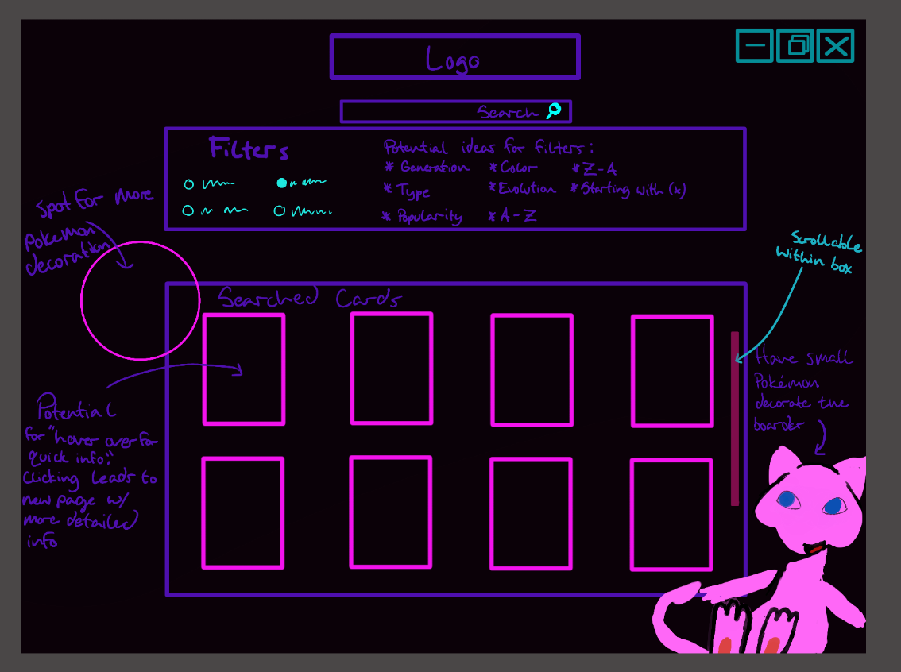

# DeckBoss Card Trading Site
## Team Members
Elliot Dubrow, Mackenzie Blaser, Brandon Cross, Matthew Wudi

# The Need:

# Competition:

There are several sites that have similar concepts as ours, but many focus on baseball or other trading cards. Other sites also usually have a section for buying and selling cards, while our plan is to just present a very nice interface for a digital collection. 

Some examples of sites that do this are:

https://www.collectors.com/Shop => Collectors.com, a site for searching and trading baseball cards (as well as others. We plan to focus on different sets of cards then what is available on this website, but in the future we could expand to baseball cards as well.

https://www.tcgplayer.com/ => Another site to collect and discover trading cards from Pokemon to Magic The Gathering. This site is much closer to what we are going for, but we would like to create a much sleeker and easier to use UI. The bulk of this sites UI is stored in drawer menus and we would like to avoid that, as it gives a cluttered user view and could be massively simplifed with a better search feature. There is no way to store a "deck" of cards so to speak, so we aim to change that with our product.

# Sample UI:

## Home Page 

## Search Page

## User Account Page

# Scope:

For the scope of our project, we are mainly focusing on having a working website for users to connect to, create accounts, and host their card collections.

We have decided to host the website on heroku and use postgreSQL as the database. Our website will be written in HTML/CSS/JS, there will be some use of jQuery and several APIs for pricing and card data. We took a look at using a framework like react to create interfaces, but as everyone in the group is more comfortable with basic web design, that is what we are going to use.
	
Our project is not a website to buy or sell cards, it is just a site to collect and price digital tokens of said cards and allow for users to present those collections to others in a nice layout. 
	
Our minimum criteria for success:
	
	1: As a user, I want to be able to create an account and add cards
	2: As a user, I want to be able to search for cards and get pricing data
	3: As a user, I want to be able to share my card collection with others.

# Pitfalls:

There are many potential pitfalls in this project. Group scheduling, keeping to proper scope and preventing scope drift. Some people in our group work and so working hours on the project might spill into the later evenings. We also will have to deal with making sure heroku has everything we need, and has the ability to scale for our userbase.

To minimize these issues, we are going to try to stick to a schedule of work. We are going to be delegating out tasks to different members, to ensure that our work doesn't overlap and that merge conflicts can be avoided. We are also going to ensure that everyone's coding environment is set up properly, as to make sure there are no issues there. Since we are using a simple tech stack for web dev, it should be easier, so the main points to check will be git and heroku set ups.

So far, unless there are schedule changes, all members will be available throughout the term to work on this project.

There are going to be several APIs that we will need to learn and apply during this project. So far, we've identified at least 1 we need so far, a pricing and card data API => https://pokemontcg.io/
	
This API offers easy access to JSON data about cards, and will allow us to deliver card information to the user easily.

In order to protect user data, we will have to apply several concepts of web security, including sanitizing input strings and preventing SQL injections. We are going to be using the most up to date user Auth specifications, and plan to continuously test our security through pen testing methods. Our user accounts will also take very little to no user meta data, in order to give users control over what data they share to the public or not.

In terms of concrete issues, two that come up are:
	
	1: How do we prevent user data exposure/deletion/alteration via sql attacks
	2: How to prevent user account information esposure/deletion/alteration

For issue #1, the main way to deal with this would be to sanitize all strings before they are allowed to interact with the database. PostgreSQL has a built in way to sanitize strings as seen in this github PR https://github.com/dwyl/learn-postgresql/issues/64 and as such we will be able to design sanitization functions for our data.

For issue #2, besides preventing SQL Injections, we will also allow very fine tuning over user data by the user. As a site with no actual buying or selling, it will be much easier to not have to take personal data from the user and as such will prevent exposure of that data. As data will mainly be accessed through heroku, having proper permissions set up to prevent malicious access will be tantamount.
